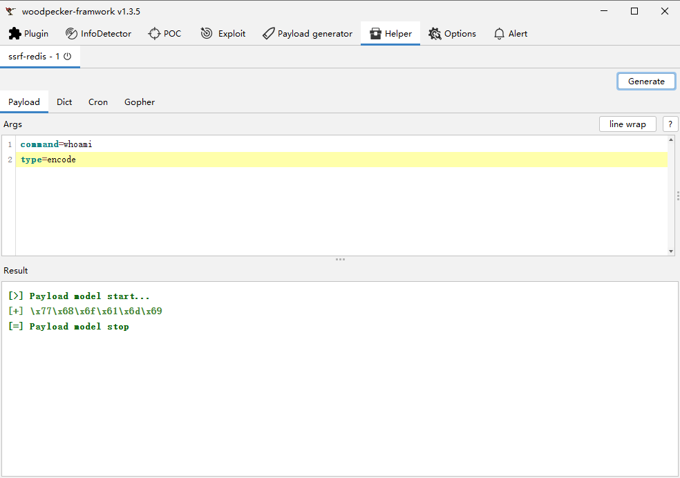
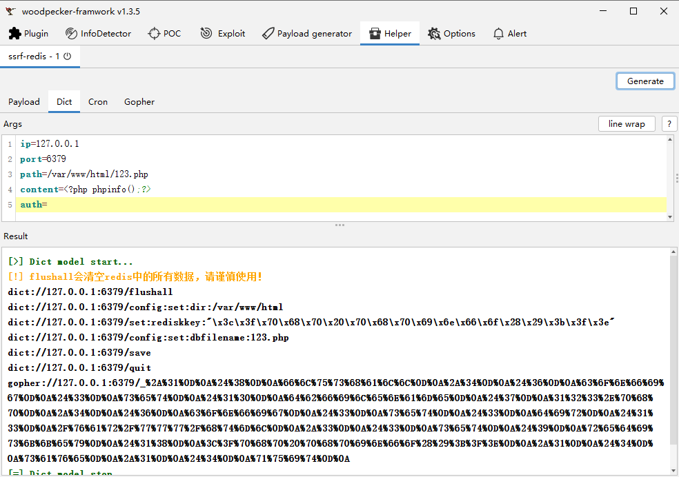
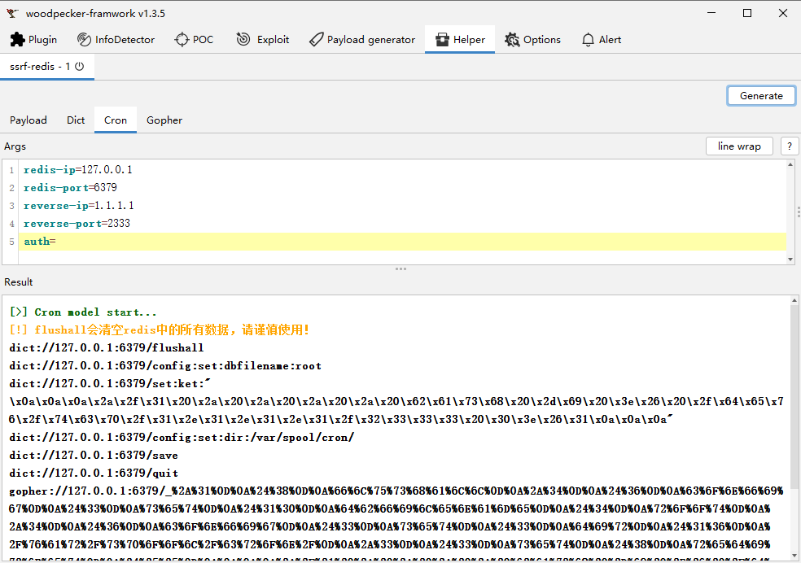
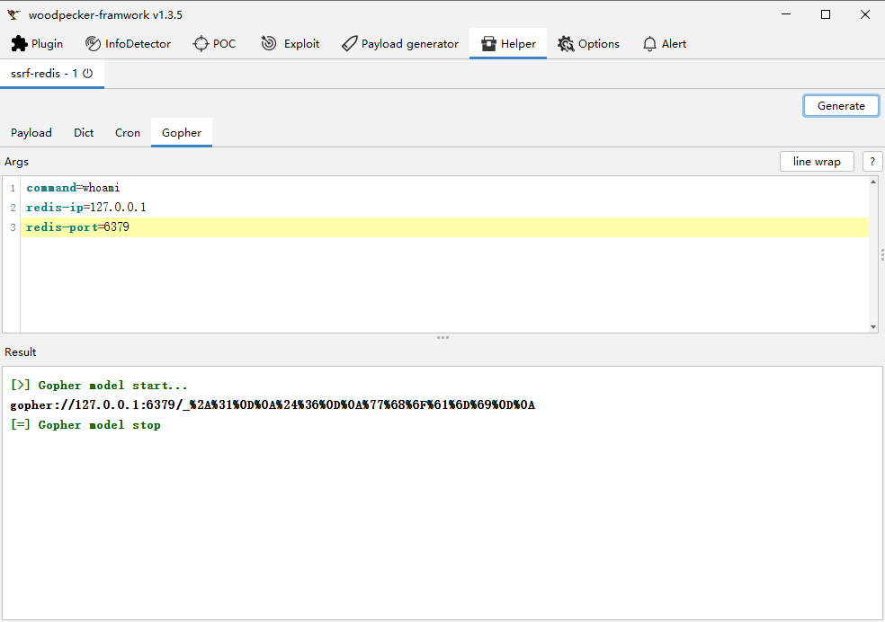

# ssrf-redis payload生成插件

Woodpecker项目插件,来源于[Woodpecker](https://github.com/woodpecker-framework/)

快速创建新插件模板,来源于[WoodpeckerPluginManager](https://github.com/kN6jq/WoodpeckerPluginManager)

# 功能

- 生成ssrf-redis dict payload
- 生成ssrf-redis 写webshell payload
- 生成ssrf-redis 写计划任务 payload
- 生成ssrf-redis gopher payload

# 截图










# 靶场

```
docker run -itd 83:80 --name redis-ssrf dockersssssx/redis-php
docker exec -it dockersssssx/redis-php bash

启动nginx
service nginx start

启动php
service php8.1-fpm start

启动redis
cd /tmp/redis-5.0.14/src/ && ./redis-server ../redis.conf
```
